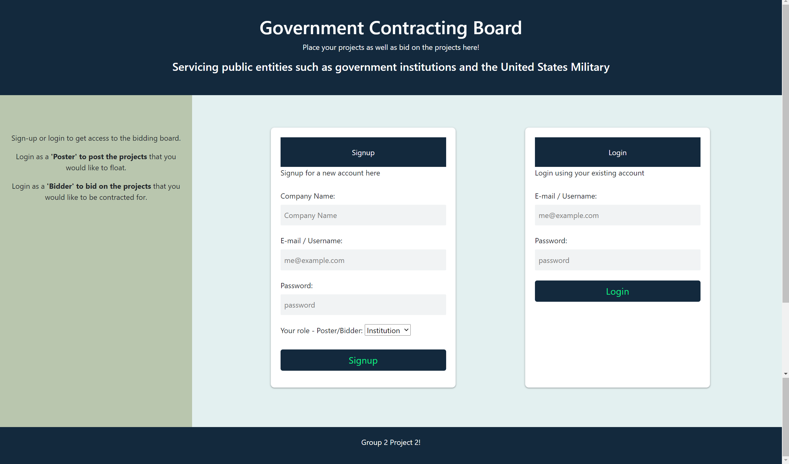
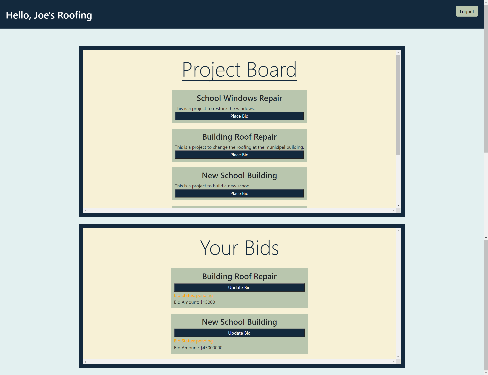
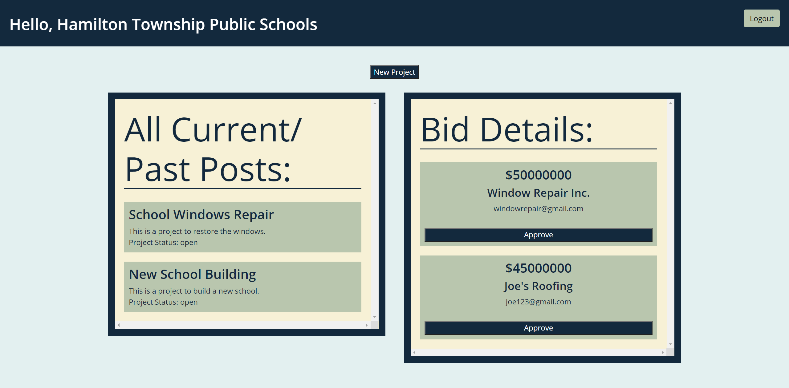

# Government Contracting Board

## Table of Contents

- [Description](#description)
- [Installation](#installation)
- [Usage](#usage)
- [Questions](#questions)

## Description

Government institutions, such as local governments, school boards, and even the U.S. military, many times do now have the in-house capabilities to complete certain projects. Lets say a school needed window replacements. The school board most likely does not have employees with the ability to do that. So, they need to post the project for contractors to bid on it. Many contractors will bid on the project, and ultimately one will be chosen to complete the project. The Government Contracting Board is a web application that allows institutions to create and post projects for contractors to bid on.

## Installation

To install, run ```npm i```, then ```npm start``` in the terminal.

## Usage

After starting the application, the user is first brought to a landing page where they can either create a new accoutn or log in to an existing account. If the user is an institution, they will be taken to a page displaying their current and past projects. They can click on a project to display the bids for that project and approve one if desired. Once approved, the status of the bid will change to "approved" and the project will become "closed". The user will also be able to create new projects.

If the user is a bidder, they will be taken to a page displaying a board with all "open" projects. There they can place a bid on an existing project. They will also be presended with all of their previous bids, along with status of the bids and the ability to update any of them.





## Questions

If you have any questions regarding the application that are not answered in this README, you can contact me at: 

github.com/ccardinale98

or

ccardinale98@gmail.com

## Links

https://project-bid-board.herokuapp.com/